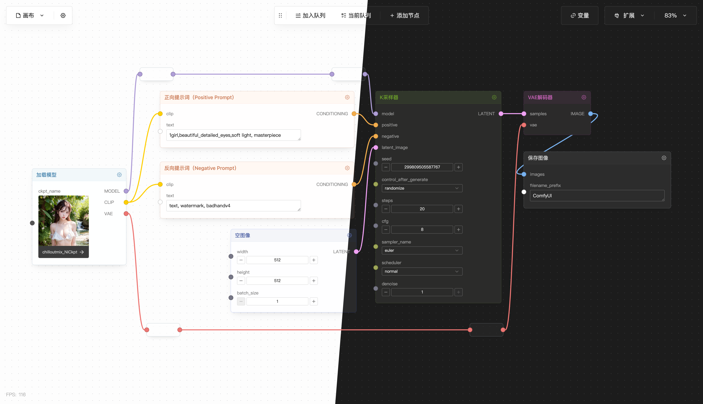

# ComfyMC

在 [ComfyUI](https://github.com/comfyanonymous/ComfyUI) 的基础上，使用 Vite / Vue3 二次设计 & 开发的 WebUI。

---

### 功能

- 更简洁易用的 UI 界面
- 带有预览图的模型选择器
- 变量系统(完善中..)
- 内置的 Prompt Tags 编辑器
- 支持撤销/重做（Ctrl+Z / Ctrl+Shift+Z）
- 支持 Light / Dark Mode
- 支持 ComfyUI Custom Nodes
- 快捷缩放视图
- MiniMap

### 快捷键

| 快捷键                  |                        |
| ----------------------- | ---------------------- |
| Ctrl + Enter            | 将当前 Flow 提交到队列 |
| Ctrl + O                | 导入 Flow              |
| Ctrl + S                | 保存(导出) Flow        |
| Backspace               | 删除选中的节点         |
| Shift + Drag            | 框选节点               |
| Ctrl / Shift + 点击节点 | 多选节点               |
| Ctrl + A                | 全选节点               |
| Ctrl + M                | 忽略/取消忽略节点      |
| Backspace / Delete      | 删除节点               |
| Ctrl + D                | 加载默认 Flow          |
| Ctrl + +                | 放大视图               |
| Ctrl + -                | 缩小视图               |
| Ctrl + 0                | 缩放视图至适合         |
| Ctrl + 1                | 缩放至 100%            |
| Ctrl + L                | 锁定编辑状态           |
| Ctrl + Z                | 撤销                   |
| Ctrl + Shift + Z        | 重做                   |

在 macOS 下可以把 Ctrl 替换为 Command

### 安装

1. 下载 Releases 中的 web.zip, 替换掉 ComfyUI 中的 web.

2. 将 ComfyMC-Service 下载到 custom_nodes 文件夹下, 安装 requirements.txt.

TODO: 一键安装之类的脚本

### 编译

`pnpm install`

`pnpm build`

### TODO

- [ ] 变量系统
- [ ] 补充快捷键
- [ ] 模型/节点管理器
- [ ] Note 节点
- [ ] GPT 节点
- [ ] 图片管理器
- [ ] 队列历史记录
- [ ] Batch
- [ ] Bug Fix
- [ ] 模版编组 / 组件编组

### Thanks

主要用到的 dependencies：

- [Vite](https://vitejs.dev/)
- [Vue-Flow](https://vueflow.dev/)
- [TDesign](https://github.com/Tencent/tdesign-vue-next)
- [ComfyUI](https://github.com/comfyanonymous/ComfyUI)

Prompt Tags 数据来源

- [sd-webui-prompt-all-in-one](https://github.com/Physton/sd-webui-prompt-all-in-one/tree/main)
